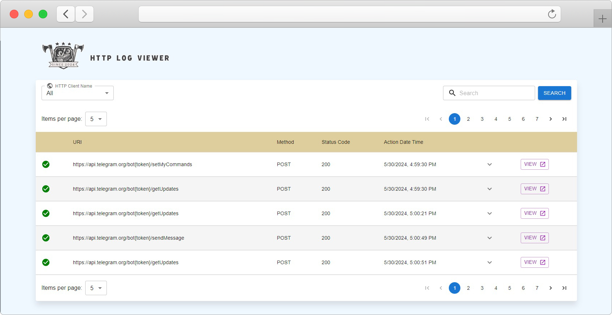
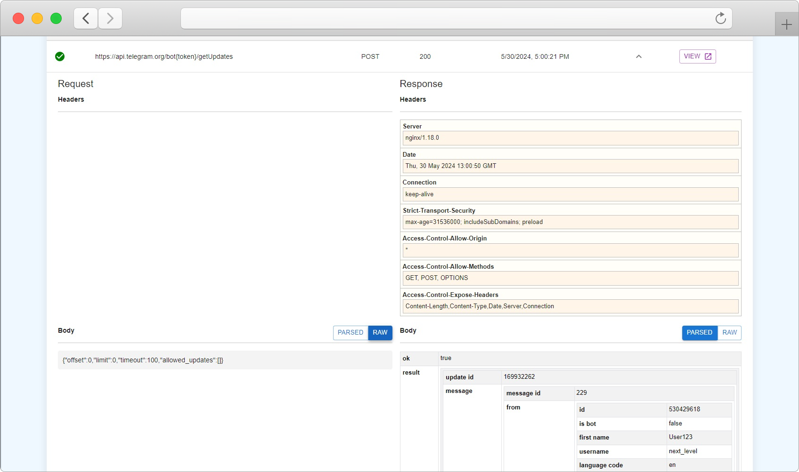
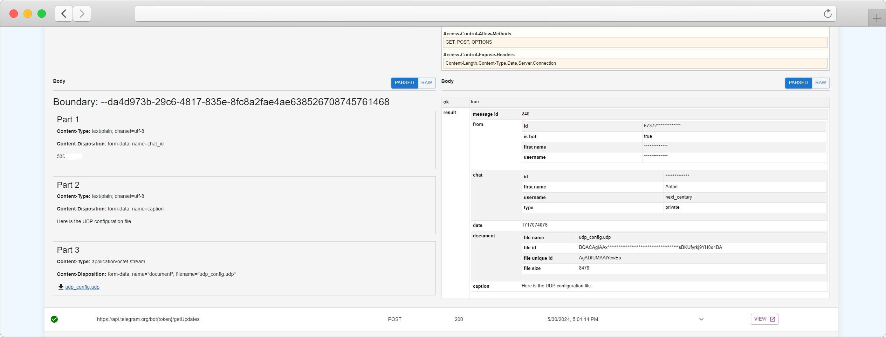

# HTTP Request Log Viewer
# + tracker included

Our HTTP Request Log Viewer is a software solution designed to simplify and enhance the process of tracking and analyzing HTTP requests and responses. With seamless integration for .NET Core applications, it captures every detail of your `HTTPClient` interactions, providing you with a comprehensive and intuitive interface for monitoring your network traffic.

The software features a user-friendly UI that enables you to view and inspect headers, parsed or raw JSON content for both requests and responses, making it an invaluable tool for developers, QA engineers, and network administrators.

## Key Features

- **Detailed Request and Response Logging**: Capture and view all HTTP requests and responses made by your application.
- **Header Inspection**: Easily inspect request and response headers.
- **JSON Parsing**: View parsed or raw JSON content for both requests and responses.
- **Multipart Data Handling**: Ability to view and download multipart data with ease. This feature allows you to see the different parts of a multipart request, including file uploads, and download individual files directly from the interface.

## Getting Started

1. **Installation**:
   - Clone the repository.
   - Navigate to the project directory.
   - Run `npm install` to install the necessary dependencies.

2. **Running the Application**:
   - Use `npm start` to run the application locally.

3. **Usage**:
   - Integrate the viewer with your .NET Core application.
   - Start logging and analyzing your HTTP requests and responses.

## License

This project is licensed under the MIT License. See the [LICENSE](LICENSE.md) file for details.
